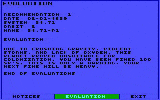

# Starflight-Reverse #

## What is Starflight? ##



Starflight developed by Binary Systems was one of the best exploration and role playing games of the 80s. It influenced a whole game genre.

To find out more about the game check the following links:

[Wikipedia](https://de.wikipedia.org/wiki/Starflight)

[Review of Starflight 1](http://crpgaddict.blogspot.de/search/label/Starflight)

[Review of Starflight 2](http://crpgaddict.blogspot.de/search/label/Starflight%20II)

[Starflight ressource page](http://starflt.com)


You can buy the game at [GoG](https://www.gog.com/game/starflight_1_2)

## What is this project about? ##

As much as playing this truly amazing game is fun, reverse engineering this game is also fun. Expect the unexpected. Normally when you reverse engineer such an old game you expect ten thousands of lines of pure assembler code, which you can analyze with the usual tools such as IDA Pro. But not this time. Actually for this game you can throw the usual tools away. They are useless. You are on your own. The reason is that Starflight was written in [Forth](https://en.wikipedia.org/wiki/Forth_(programming_language)), a language I barely knew about.

When you dissect the executable it reveals some fantastic internals
 * Forth is a stack machine, with a [reverse Polish notation](https://en.wikipedia.org/wiki/Reverse_Polish_notation). The compiled code keeps this structure.
 * The x86-assembly code consumes less than 5% of the size of the exectuable
 * More than 90% of the executable are actually two-byte pointers.
 * 2000 of around 6000 word names, which you would call debugging symbols nowadays, are still in the code, but encrypted. This enables us to reverse engineer a high portion of the original source code.
 * The Forth interpreter (not compiler) is still part of the executable and can be enabled
 * The executable is slow. Besides of some assembler optimized routines, the code wastes at least 50% of the CPU cycles just by jumping around in the code.
 * The executable makes heavily use of code overlays, which makes the decoding much more complicated

For more information take a look at the [technical articles](https://github.com/s-macke/starflight-reverse/tree/master/webarchive)

## Usage ##

Just put the content of the original Starflight folders into the folders `starflt1-in` and `starflt2-in` and run `make`. You should get two executables (`disasOV1` and `disasOV2`), which produces the content in the folders `starflt1-out` `starflt2-out`. The generated output is part of this repository.

## The main building block ##

Forth is basically a stack machine and uses [indirect threading](https://en.wikipedia.org/wiki/Threaded_code#Indirect_threading).
You can understand the structure of the game code when you just analyze this piece of code, which is acually the equivalent of the command '+'.

```Asm
0x0f74: pop    ax
0x0f75: pop    bx
0x0f76: add    ax,bx
0x0f78: push   ax
0x0f79: lodsw
0x0f7a: mov    bx,ax
0x0f7c: jmp    word ptr [bx]
```

There are around a hundred of those code blocks scattered in the executable, surrounded by seemingly incomprehensible data. To understand these code blocks lets look at the equivalent in C.

```C

void Call(uint16_t word_adress)
{
    // the first two byte of the word's address contain 
    // the address of the corresponding code, which must be executed for this word 
    uint16_t code_address = Read16(word_address);

    switch(code_address)
    {
        .
        .
        .
        case 0x0f74: // word '+'
            Push16(Pop16() + Pop16());
            break;
        .
        .
        .
    }
}

void Run()
{
    uint16_t instruction_pointer = start_of_program_pointer;
    while(1)
    {
        uint16_t word_address = Read16(instruction_pointer);
        instruction_pointer += 2;
        Call(word_address);
    }
}

```
The instruction pointer (the si register above) points to the address of the Forth "word" in memory. The word contains the address to the assemler code of the word and optional data. This is a space efficient encoding, but speedwise it is a catastrophe.

## Translation ##

The disassember transpiles the FORTH code into C-style code.. Most of the transpiled code compiles. To understand what the program does take a look at the following table. It takes the "bytecode" as input and transforms it into C.

Forth code:
```FORTH
: .C ( -- )
\ Display context stack contents.
  CR CDEPTH IF CXSP @ 3 + END-CX
               DO I 1.5@ .DRJ -3 +LOOP
            ELSE ." MT STK"
            THEN CR ;
  EXIT
```

Transformation:

| BYTECODE |   FORTH     | C      |
| -------- | ----------- | ------ |
|          | : .C ( -- ) |`void DrawC() { `|
|          |             |`  unsigned short int i, imax; `|
| 0x0642   | CR          |`  Exec("CR"); `|
| 0x75d5   | CDEPTH      |`  CDEPTH(); `|
| 0x15fa   | IF          |`  if (Pop() != 0) { `|
| 0x0020   |             | |
| 0x54ae   | CXSP        |`    Push(Read16(pp_CXSP) + 3);`|
| 0xbae    | @           | |
| 0x3b73   | 3           | |
| 0x0f72   | +           | |
| 0x4ffd   | END-CX      |`    Push(Read16(cc_END_dash_CX));`|
| 0x15b8   | DO          |`    i = Pop();`|
|          |             |`    imax = Pop();`|
|          |             |`    do {`|
| 0x50e0   | I           |`        Push(i);`|
| 0x4995   | 1.5@        |`        _1_dot_5_at_();`|
| 0x81d5   | .DRJ        |`        DrawDRJ();`|
| 0x175d   | -3          |`        Push(-3);`|
| 0xfffd   |             ||
| 0x155c   | +LOOP       |`    int step = Pop();`|
| 0xffff   |             |`    i += step;`|
|          |             |`    if (((step>=0) && (i>=imax)) \|\| ((step<0) && (i<=imax))) break;`|
|          |             |`    } while(1);`|
| 0x1660   | ELSE        |`  } else {`|
| 0x000b   |             ||
| 0x1bdc   | " MT STK"   |`    PRINT("MT STK", 6);`|
| 0x06     |             ||
| 0x4d     | 'M'         ||
| 0x54     | 'T'         ||
| 0x20     | ' '         ||
| 0x53     | 'S'         ||
| 0x54     | 'T'         ||
| 0x4b     | 'K'         ||
|          | THEN        |`  }`|
| 0x0642   | CR          |`  Exec("CR");`|
| 0x1690   | EXIT        |`}`|
